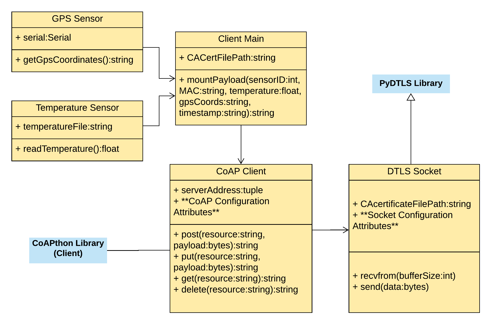
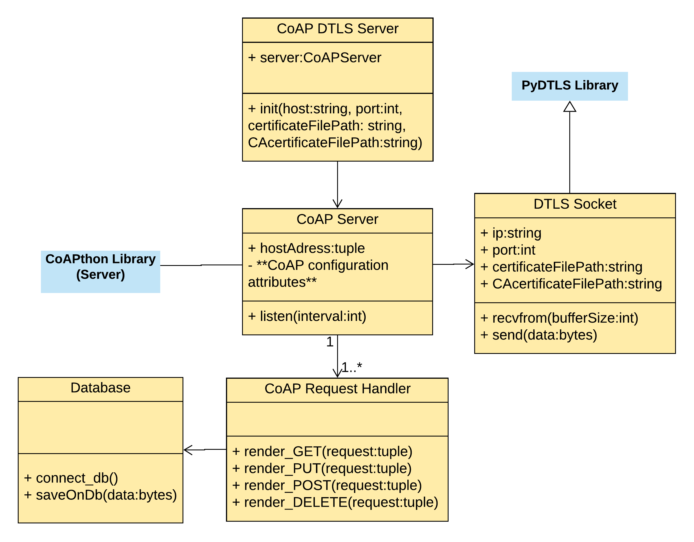

# CoAP-DTLSApp

An application regarding the use of sensors, Raspberry Pi 3, CoAP and DTLS. It uses sensors to read temperature and get the GPS location
and send this information to a server. The communication between the Raspberry Pi and the server is done through a DTLS socket used by 
the CoAP (Constrained Application Protocol) instance.

Use it on PYTHON ``2.7`` only. This ``WILL NOT`` work with Python 3.

# CoAP library

CoAPthon for python 2.7 and is already included if you clone the depository. You can also download it using pip.

# DTLS library

PyDTLS for python 2.7. Also included and might be downloaded via pip.

On PyDTLS source code file ``openssl.py`` there are the following lines:

```Python
    libcrypto = CDLL("libcrypto.so.1.0.0")
    libssl = CDLL("libssl.so.1.0.0")
```
Depending on your linux system, the ``libs 1.0.0`` version might not be available. Alternatively, ``libcrypto.so.1.0.2`` and ``libssl.so.1.0.2`` also work with PyDTLS, so you would have to change the lines to:

```Python
    libcrypto = CDLL("libcrypto.so.1.0.2")
    libssl = CDLL("libssl.so.1.0.2")
```

From experience:

Ubuntu 18 has 1.0.0.

Raspian 10 has 1.0.2.


# General Class Diagram

The diagrams below ``ARE NOT`` a true representation of the software design, but are intended to give the reader a general notion of the software structure.

## Client side



## GPS Sensor and Temperature Sensor
Classes design to extract information, respectively, from GPS and Temperature sensors.

## Client main

This class reads information from the sensors and the system to concanate it and send it using a ``CoAP Client`` instance.

## CoAP Client

It is a class that has some relationships with the ``CLIENT`` side of CoAPthon library. It basically implements the ``POST``, ``PUT``, ``GET`` and ``DELETE`` methods, sending information trough the ``DTLS Socket`` class.

## DTLS Socket

It is a patched Python socket to implement and configure a DTLS Socket. It can send and receive bytes securely. The ``CAcertificateFilePath`` makes possible for the client to check wheater the CoAP server is legitimate or not.

## Server side



## CoAP DTLS Server

This instantiates the ``CoAP Server`` class, attaching a ``DTLS Socket`` instance and a ``CoAP Request Handler`` to it.

## CoAP Server

It is a class that has some relationships with the ``Server`` side of CoAPthon library. When instatiated, some configurations are set and after that the server can listen to requests by calling the ``listen`` methods.

## CoAP Request Handler

Request handlers implement the desired treatment for each CoAP operation (POST, PUT, GET and DELETE) according to the application purpose.

This  class,  coded  on  ``GpsFlowTempResource``, inherits characteristics from the CoAPthon class Resource.

A CoAP server might have many request handlers for each resource.

On our application, the only operation implemented was POST, which called ``Database`` instance to save the POST payload in the server.

## DataBase

Class to save the received data in a ``MySQLdb`` database.

## DTLS Socket

It has the same purpose of the ``CLIENT`` socket, but it also has ``IP``, ``port`` and the server's ``certificate file`` as attributes.

# GPS and temperature sensors

Temperature sensor: ds18b20 keyes

GPS module: Ublox 7

# Code modifications

Some modifications to the original CoAPthon code were done to improve and flexibilize the initialization methods of client and server sides. On the original library, the cryptography configuration was fixed with static variables. With the modifications, it is now possible to send as parameter the filename of the X.509 certificate, on PEM format, to the initialization method. This gives flexibility to the security aspects of the application.

## CoAPthon default server initialization

CoAPDtlsServer is the class that represents the server, receiving IP and port as parameters to start the certificate and DTLS socket configurations. Then, the socket is passed as a parameter to the CoAP server instance. It is important to highlight the fact that, for testing purposes, a fictitious certificate authority signed the socket certificate.


```Python
class coapDtlsServer(object):

    def __init__(self, host, port):
        self.host_address = (host, port)

        self.pem = self._setUpPems()

        # Set up a server-side DTLS socket
        _sock = socket.socket(socket.AF_INET, socket.SOCK_DGRAM)
        _sock.setsockopt(socket.SOL_SOCKET, socket.SO_REUSEADDR, 1)
        _sock = wrap_server(_sock,
        keyfile=self.pem['SERVER_KEY'],
        certfile=self.pem['SERVER_KEY'],
        ca_certs=self.pem['CA_CERT'])
        _sock.bind(self.host_address)
        _sock.listen(0)

        # Connect the CoAP server to the newly created socket
        self.server = CoAPServer(self.host_address,
        starting_mid=None,
        sock=_sock,
        cb_ignore_listen_exception=self._cb_ignore_listen_exception)
        self.server.add_resource('gpsflowtemp/', GpsFlowTempResource())
    
```

## Our Server Initialization Updated

As hardcoded certificate do not represent a good practice, we added the certificates filenames as parameters.

```Python
  # New parameters: 
  # pemServerKeyFileName (server key/certificate filename) and 
  # pemCAFileName (CA certificate filename)
class coapDtlsServer(object):
    def __init__(self, host, port, pemCertAndServerKeyFileName, pemCAFileName):
        self.host_address = (host, port)

        # Set up a server-side DTLS socket
        _sock = socket.socket(socket.AF_INET, socket.SOCK_DGRAM)
        _sock.setsockopt(socket.SOL_SOCKET, socket.SO_REUSEADDR, 1)
        #expecting Cert and Private key merged in one file
        _sock = wrap_server(_sock,
                            keyfile=pemCertAndServerKeyFileName,
                            certfile=pemCertAndServerKeyFileName,
                            ca_certs=pemCAFileName)
        _sock.bind(self.host_address)
        _sock.listen(0)

        # Connect the CoAP server to the newly created socket
        self.server = CoAPServer(self.host_address,
                                 starting_mid=None,
                                sock=_sock,
                                cb_ignore_listen_exception =  
                                self._cb_ignore_listen_exception)
        # Add resource by passing the URI and the Instance of the Resource
        self.server.add_resource('gpsflowtemp/', GpsFlowTempResource())
```

## CoApthon default Client Initialization

The client part of CoAP source code was created based on the method ``test_ok_with_handshake_on_send``, which can be found on the file ``test_secure.py`` of CoAPthon library. Similarly to the server-side, on the client-side, there are the certificate configurations followed by the DTLS socket configurations. However, the only certificate on the client-side is the certificate authority's certificate. The client also defines the desired cipher suite. AES on GCM mode was defined on the 13th line to obtain symmetric authenticated cryptography and Elliptic Curve Diffie-Hellman Ephemeral (ECDHE) as symmetric key exchange algorithm. After that, a client is instantiated by the constructor of HelperClient, passing server address and socket as parameters. 

```Python
class coapDtlsClient(object):

    def __init__(self, host, port):
        #Set Up certificates
        self.pem = self._setUpPems()

        # Set up a client-side DTLS socket
        _sock = socket.socket(socket.AF_INET, socket.SOCK_DGRAM)
        _sock.setsockopt(socket.SOL_SOCKET, socket.SO_REUSEADDR, 1)
        _sock = wrap_client(_sock,
        cert_reqs=ssl.CERT_REQUIRED,
        ca_certs=self.pem['CA_CERT'],
        ciphers="ECDHE+AESGCM",
        do_handshake_on_connect=True)

        # Connect the CoAP client to the newly created socket
        self.server_address = (host, port)
        self.client = HelperClient(self.server_address,
            sock=_sock,
            cb_ignore_read_exception=self._cb_ignore_read_exception,
            cb_ignore_write_exception=self._cb_ignore_write_exception)
```

## Our Client Initialization Updated
